# Apache Hive  Project
This project focuses on working with Apache Hive to create databases and tables, load data stored in HDFS, define appropriate data types, and query structured data using HiveQL.

The project demonstrates how Hive can be used as a data warehouse tool on top of Hadoop and HDFS. The main goal is to understand how data stored in HDFS can be organized into tables and accessed using SQL-like queries.

## Technologies Used
- Apache Hive
- Hadoop HDFS
- HiveQL
- Docker
- Linux Terminal
- CSV / Text 
- Files

## Project Objectives
- Start and work with the Hadoop and Hive environment.
- Create and manage Hive databases.
- Create tables using different Hive data types.
- Use external tables with HDFS data.
- Define row format and field delimiters.
- Load and access data stored in HDFS.
- View table structures and column data types.
- Query data using HiveQL.
- Understand the relationship between Hive and HDFS.

## Step 1: Start Hive Console 
Here, if you are logging into your docer desktop trying to enter hive console for very first time then you have to run restartHive else just run Hive only. As restart hive is used to restart all the hive services. 
In case you have already existed hive console then just use hive command instead of restarthive
 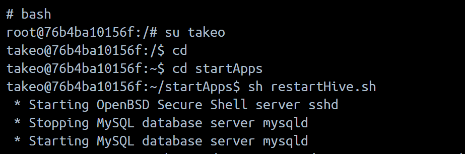

 ## Step 2: Check data in HDFS
 After this open external terminal. Now, we'll be using Hadoop where we'll be creating one empty file.
 We're going to create 'customer.txt and we'll paste 4 lines of already created/ready data in that
 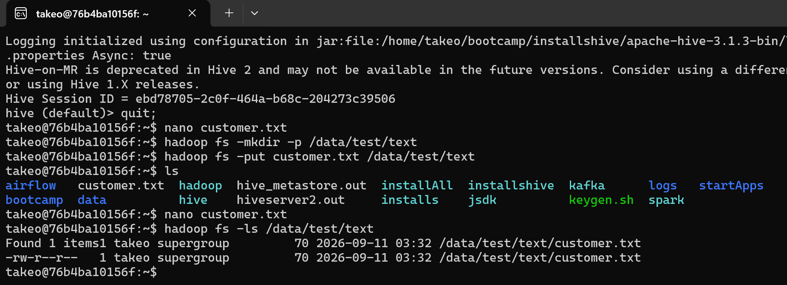

## Step 3: Creating Database in Hive Console
Creating database named xyz. Here instead of default data base storage now we'll be using that xyz database to store our data. 
And viewing the data we stored in that database
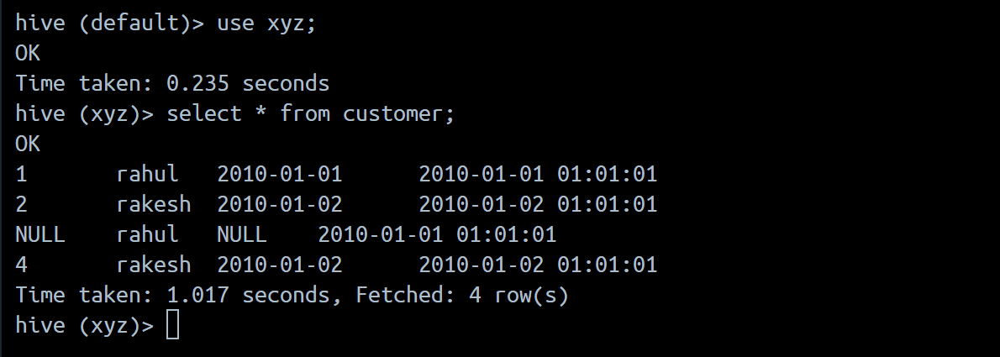

## Step 4: Creating external table in hive console and checking if we drop that external table metadata along with data will drop or not
External table created with column name and datatype 

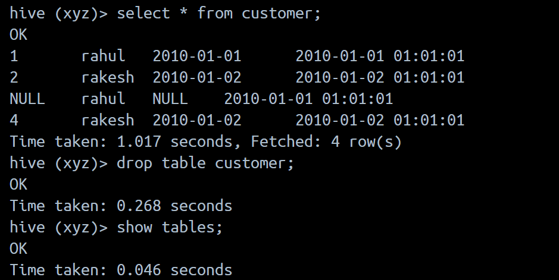

Now checking it in default HDFS Storage where the data we created stores in default storage location ie /data/hive/warehouse/xyz.db
that is the db we created its empty.
It means that if we drop external table even metadata is dropped data is still there as HDFS is the original owner of data. 

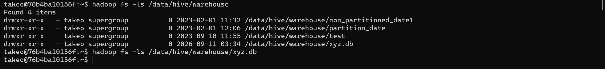

## Step 5: Creating Manage table in HDFS
The below command wil show hive directory or warehouse (hadoop fs -ls/data/hive/warehouse).
Everytime when we create a database or a table that will create a folder here (hadoop fs -ls/data/hive/warehouse/xyz.db)

Right now its empty becauze we have external table not the manage table (external table points to somewhere else in hive not in HDFS)

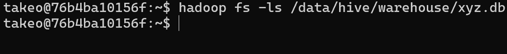

Creating emp table

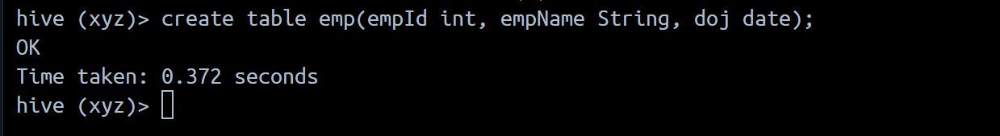

Right now if we run ls command and check in that hadoop location(hadoop fs -ls/data/hive/warehouse/xyz.db) then still the folder is empty just created file name EMP (To view it we have to insert the records/ data with datatypes). Going to hive and insert into command "insert into imp values(1, 'vishal', '2000-01-01;)"
(I am the owner of this data because I created it through Hive)
Now Lets Verify the data in HDFS to view the data we inserted 

## Step 6: Loading data from one table to another
(create table emp1(empId int, empName String, doj date);) <---- Creating metadata first

Let's load data from emp table to emp1 table using command: INSERT INTO TABLE emp1 select * from emp;
if we again use this command I mean total 2 times this happens we started with empty file emp1 
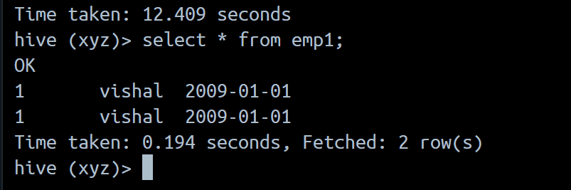

Now lets load again using another way:
INSERT OVERWRITE TABLE emp1 select * from emp;
It copies the data from emp and paste to emp1 but the old data of emp1 is totally replaced by emp(old data of emp1 is deleted)

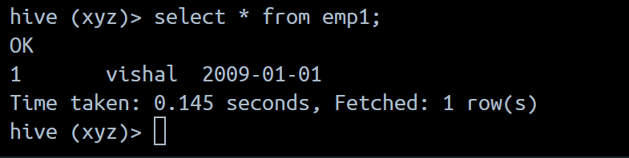

Summary:
Override ---> removes old data and put the new one 
Into     ---> keeps the old data and adds the new one 

## Step 7: Creating non-partitioned table and partitioned table
In Hive there are 2 ways to store data, non-partitioned table(data column) and partitioned table

i)   Non Partitioned table creation

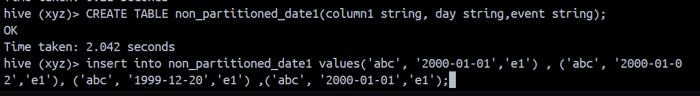
While we inserted a data into this non-partitioned table then behind the scene it created a file in that file it put all the columns we just created they are called data columns.

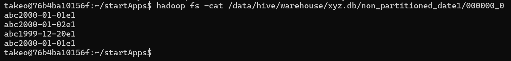

ii) Partitioned table creation 

Here we are going to create partition table and overwrite value from non partition table by inserting value from there. 

At first attempt of overwriting values from non partitioned table to partitioned table it required to run set command (set hive.exec.dynamic.partition.mode=nonstrict;)

Important thing in this image is after column1 the day and event both day and event should be in order else day value will go in event and event value will be stored in day that is incorrect.

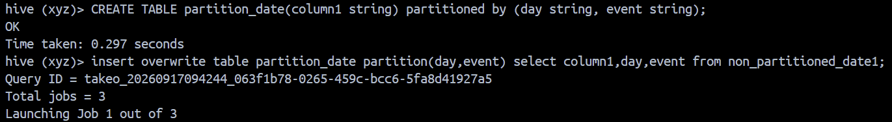

Viewing value its same as non-partitioned table because we overwrite it to partitioned table.

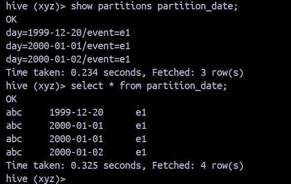

Now Lets see the difference between these two(non-partitioned and partitioned) in HDFS how both type of data is stored 

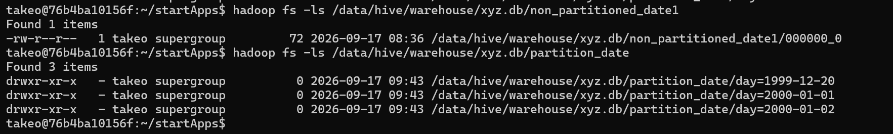
We can see - (hiphon) all the way to the left of the file name of the non-partitioned table that is the proof it stores data inside file

But when we view the data of partitioned table it is stored in directory there is d all the way to the left that is the proof that it stoores data in directory instead of file that is the difference. 

## Step 8: Dropping partition table using 'Alter' command

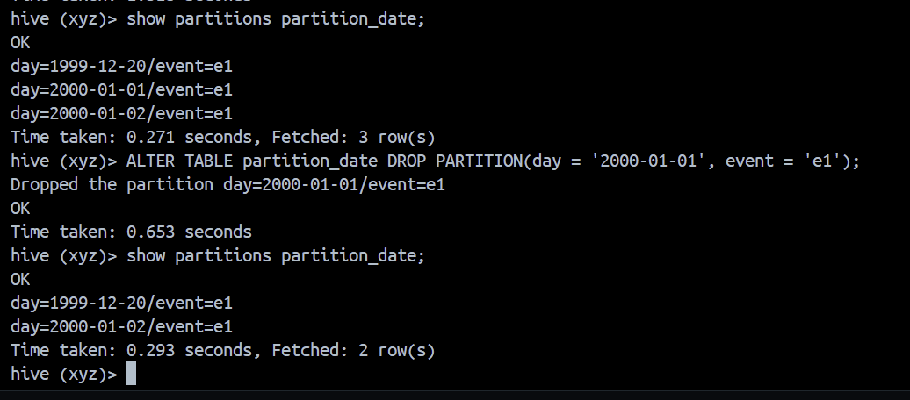

Here we are viewing the partition date before and after dropping one partition date using alter command. As we created and inserted data in hive we are the owner not the HDFS so entire data along with data type is deleted/dropped

# Conclusion 
This Apache Hive project gave me the general idea of how to work with big data using Hive within a Docker environment. I practiced creating databases and tables, specifying column data types, loading CSV data, and retrieving records using HiveQL. I also learned how external tables function and how Hive organizes and manages data stored in HDFS.

Overall, this project improved my understanding of data warehousing, SQL based data processing, and the role of Apache Hive in the Hadoop ecosystem. It provided hands-on experience with big data technologies and helped me establish a stronger foundation for further learning in data engineering, including ETL pipelines and cloud-based data platforms.